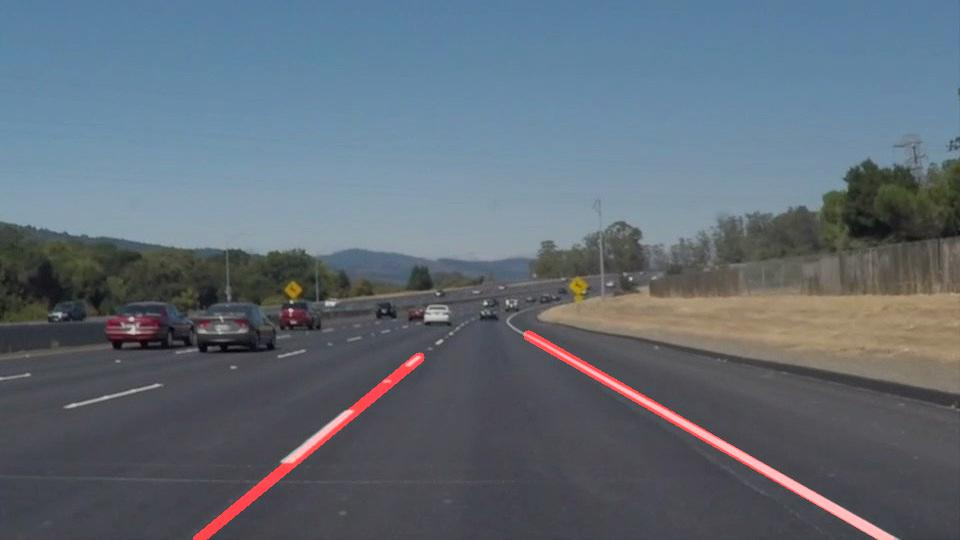
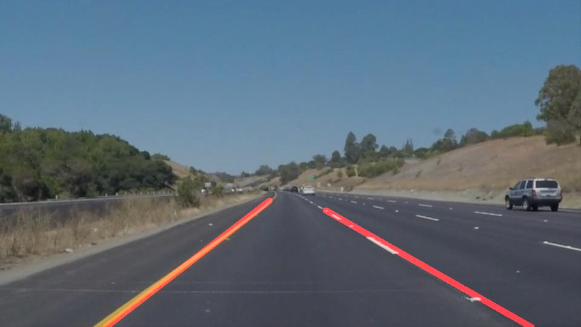

# **Finding Lane Lines on the Road** 

## Writeup Template

### You can use this file as a template for your writeup if you want to submit it as a markdown file. But feel free to use some other method and submit a pdf if you prefer.

---

**Finding Lane Lines on the Road**

The goals / steps of this project are the following:
* Make a pipeline that finds lane lines on the road
* Reflect on your work in a written report

[//]: # (Image References)

[image1]: ./test_images/solidWhiteCurve.jpg "Test Image"

---

### Reflection

### 1. Describe your pipeline. As part of the description, explain how you modified the draw_lines() function.

My pipeline consist of the following steps:

1. Convert the image to grayscale
2. Apply the Gaussian Blur to reduce the noise 
3. Find the edges in picture using Canny Edge Algorithm
4. Create a mask for lane segmentation from the image. Since, camera is attached to a fixed position. I manually defined a polygon that would enclose the lane lines in all the images and videos.
5. Mask the output of step 3(Canny Edge Detection) with the mask calculated in step 4. This removes all the unwanted background.
6. Find the lane lines using Hough Transform
7. Extrapolate the lines to make a solid lines: 
    a. In this step, I found the slope of left and right lanes. 
    b. I seperated the lines that align with left and right lanes. And stored the end points of these lines in 2 arrays corresponding to lanes.
    c. Then I used the top left and right vertex of my polygon defined in step 4, and used K nearest neighbor algorithm to find K nearest point corresponding to left and right top vertex.
    d. Averaged these poins and calculated where left and right lane lines end or get curved.
    e. Used the slope calculated in 7a, and found lines passing points calculated in 7d. with corresponding slope.
    f. Return the end points of the lanes
8. Draw the lines calculated on 7 on image
9. Combine the images and show on output.  

If you'd like to include images to show how the pipeline works, here is how to include an image: 

### 2. Identify potential shortcomings with your current pipeline

In the earlier part of doing this project, I realized that curved lines would cause a problem. I tried to overcome that problem. I think I did well in that part. However, I see following shortcoming.

1. Changing camera position would make lane detection fail, as seen on the optional video.
Remedy: I think removing the bottom part of the image and modifying the vertices would make it work. I wanna try this later.

2. It would also fail when the lane width changes

### 3. Suggest possible improvements to your pipeline

1. I would like to process imageas as to avoid what we saw in the challenge.mp4 file.
